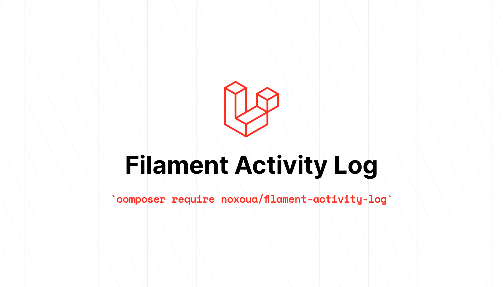
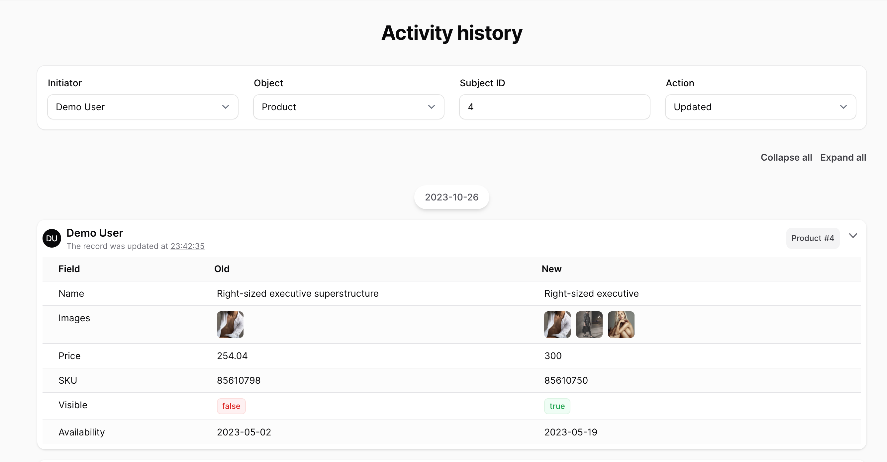

<div class="filament-hidden">



</div>

# Filament Activity Log

[](https://packagist.org/packages/noxoua/filament-activity-log)
[](LICENSE.md)

[](https://packagist.org/packages/noxoua/filament-activity-log)


This package adds a page to the Filament Admin panel to view the activity log generated by [`spatie/laravel-activitylog`](https://github.com/spatie/laravel-activitylog).

<div class="filament-hidden">



</div>

## Installation


Install via Composer.

**Requires PHP 8.0 and Filament 3.0+

```bash
composer require noxoua/filament-activity-log
```

> **Warning**
<!-- > This plugin only offers a page to show activities related to your model. You need [`spatie/laravel-activitylog`](https://github.com/spatie/laravel-activitylog) installed and configured for it to work. It is important you are using the `LogsActivity` trait as per [Spatie's docs](https://spatie.be/docs/laravel-activitylog/v4/advanced-usage/logging-model-events) for this work as we use the '->activities()' method of the trait. -->

## Usage

Make sure you use a **custom theme** and the vendor folder for this plugins is published, so that it includes the Tailwind CSS classes.

### Create a page

Create a new page and extends the `ListActivities` class.

```php
<?php

namespace App\Filament\Pages;

class Activities extends \Noxo\FilamentActivityLog\Pages\ListActivities
{
    protected static ?string $slug = 'activities';
}
```

<!-- ### Link to your page

Use a Filament action to link to your from your table or page.

```php
$table->actions([
    Action::make('activities')->url(fn ($record) => YourResource::getUrl('activities', ['record' => $record]))
]);
``` -->

## Contributing

Please see [CONTRIBUTING](.github/CONTRIBUTING.md) for details.

## License

The MIT License (MIT). Please see [License File](LICENSE.md) for more information.
