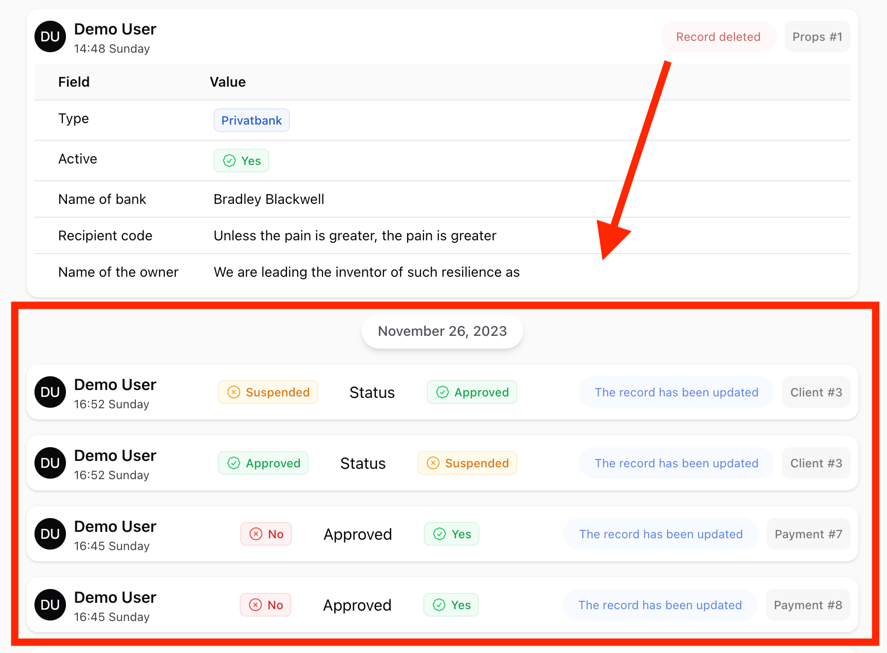

# Fields

___

In the context of the Logger class, you have the flexibility to define which fields and relations should be logged for your model. This allows you to track changes to specific attributes and related data.


### Badge

```php
$logger->fields([
   'name' => 'badge:danger',
   // Field::make('name')->badge('danger'),
])
```


____

### Enum

```php
$logger->fields([
   Field::make('status')
         ->enum(App\Enums\OrderStatus::class)
         ->label('Status'),
])
```


____

### Date & Time

```php
$logger->fields([
   // 'published_at' => 'date:j F, Y'',
   // 'published_at' => 'time',
   // 'published_at' => 'datetime',
   Field::make('published_at')
         ->date()
         ->label('Publish Date'),
])
```


____

### Boolean

```php
$logger->fields([
   // 'is_visible' => 'boolean',
   Field::make('is_visible')
         ->boolean()
         ->label('Visible'),
])
```


____

### Media

```php
$logger->fields([
   // 'media' => 'media',
   Field::make('media')
         ->media(gallery: true)
         ->label('Images'),
])
```


____

### Money

```php
$logger->fields([
   // 'price' => 'money:EUR',
   Field::make('price')->money('EUR'),
])
```


____

### Key-Value

```php
$logger->fields([
   Field::make('meta')
         ->keyValue(differenceOnly: true)
         ->label('Attributes'),
])
```

 #### Key-Value with fields
```php
$logger->fields([
   Field::make('recipient')
         ->hasOne('recipient')
         ->keyValue([
            Field::make('recipient.full_name'),
            Field::make('recipient.phone'),
            Field::make('recipient.shipping_provider'),
         ]),
])
```


____

### Relation

```php
$logger->fields([
   Field::make('roles.name')
         ->hasMany('roles')
         ->label(__('Roles'))
         ->badge(),

   Field::make('permissions.name')
         ->hasMany('permissions')
         ->label(__('Permissions'))
         ->badge(),

   Field::make('status.name')
         ->hasOne('status')
         ->label(__('Status'))
         ->badge(),
])
```


____

### Table

```php
$logger
   ->preloadRelations('items.product')
   ->fields([
      Field::make('items')
            ->hasMany('items')
            ->table([
                Field::make('product.name')->hasOne('product'),
                Field::make('qty'),
                Field::make('unit_price'),
            ])
            ->label('Items'),
        ]),
```


____

### Difference

```php
$logger->fields([
   Field::make('description')
         ->difference(),
])
```

{: .note }
For now, it is compatible with <u>text only</u>.


____

### Inline

```php
$logger->fields([
   Field::make('active')
         ->boolean()
         ->inline(), // <----- here
])
```

{: .note }
Change is displayed inside the header. <u>Only works if only one field has been changed</u>.


